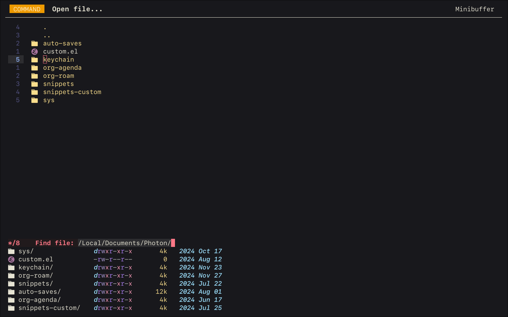

# Description
A modeline package for GNU Emacs, built for the [Photon project](https://github.com/seb-hyland/Photon).
Photon-modeline is the first ever "global" mode-line; it presents a single modeline at the top of the frame regardless of how many buffers are open.

# Features
- Displays information for the currently active buffer
  - Also works in the minibuffer!
  - Provides an API for "overriding" the active command display for specific minibuffer commands
- Integrates with Git to display the status of the current repository
  - Square delimiters around the repo name indicate a clean working tree, while round delimiters indicate uncommitted changes
- Integrates with Evil mode for Vim-style modal editing 

Note: photon-modeline internally achieves its effects by hacking tab-bar-mode to display modeline information instead. If you use tab-bar-mode, this functionality will be lost.

# Screenshots

